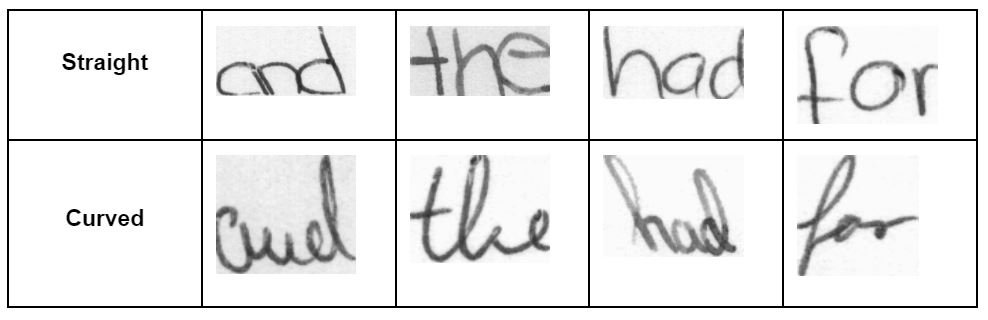

# hw_style
LeNet5 inspired model for handwriting style classification [paper](https://drive.google.com/file/d/16HeDXA8ezecHZqSSOLZeMQGWxy9lnkVL/view)

## Installation and Usage

1. Clone this repository.
2. Download and extract the [dataset](https://drive.google.com/file/d/1ew11mgCbdTESKxKkvS6V8jul3jAx2qLZ/view?usp=share_link)
3. Run train.py
